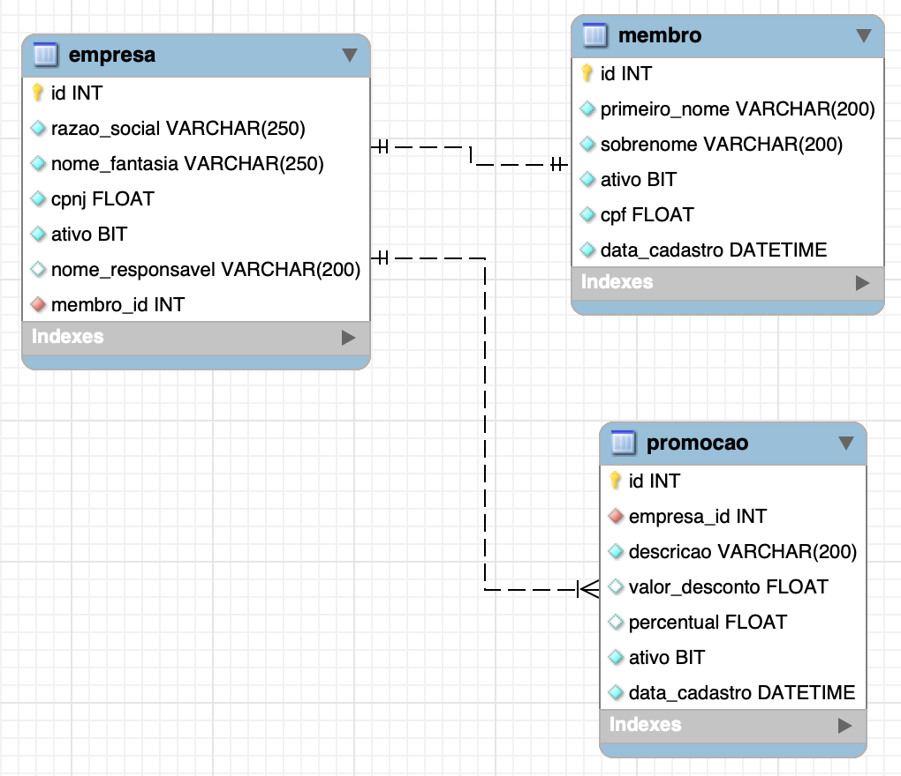

# NOSSO DESAFIO
Bem vindo. Estamos interessados em ver como você desenvolve com as tecnologias que domina. Que jeito melhor do que apresentando um projeto feito por você?
Queremos que você nos apresente uma aplicação que realize o CRUD de 3 entidades (Empresa, Membro e Promoção). Aqui vão as regras.
## REGRAS GERAIS
- Faça a [cópia](https://help.github.com/articles/fork-a-repo/) do repositório (fork), desenvolva e submeta uma [solicitação de mudança](https://help.github.com/articles/creating-a-pull-request/) (pull request) no branch master.
- A aplicação deve ser composta por Backend e/ou Frontend. Caso ache que so vai conseguir fazer um dos dois no tempo disponível, foque nele.
- O Backend deve prover uma [API REST](https://pt.wikipedia.org/wiki/REST)
- Você deve cumprir no mínimo os requisitos abaixo.
- Items marcados com (+) não são obrigatórios, mas servem como diferencial.
- Nas instruções para execução da aplicação é essêncial conter o seu nome e email.

## REQUISITOS

Segue abaixo os requisitos e as entidades relacionadas para o cadastros das entidades de Empresa, Membro e Promoção:

A interface + backend da aplicação deverão permitir recuperação da lista de, remoção / atualização dos clones cadastrados e cadastro de clones.
Considere que só um usuário vai usar a aplicação e que este usuário não precisa de login.

## LINGUAGENS
  - PHP 7
  
## FRAMEWORKS

### BACKEND
São válidos para o backend os seguintes frameworks:

- Lavarel 5
- Cake PHP 3
- Zend Framework 2

### FRONTEND
O frontend pode ser Web ou Mobile. Sugerimos as seguintes tecnologias:

- Angular 5,6 ou 7

### BANCO DE DADOS
- Serão aceitos somente os bancos MySQL e PostgreSQL, é necessário disponibilizar os migrations para a eecução do projeto.

### BUILD E EXECUÇÃO
- Envie as instruções para o build/execução da sua aplicação, disponibilizamos um [exemplo](README.template.md) para ajudar você. Cuidado com dependências externas que inviabilizem ou dificultem essas atividades.

# BOA SORTE!
